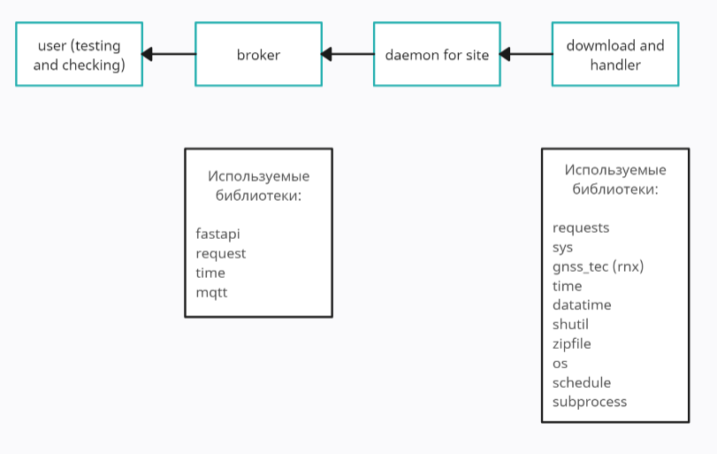

# practice

## Описание проекта

Этот проект представляет собой сервер, который имитирует работу сети станций, непрерывно публикуя данные наблюдений в реальном времени. Данные, изначально полученные из системы `SIMURG` и сохраненные в формате `RINEX`, обрабатываются и преобразуются в потоковый формат для удобства использования.

## Как это работает?

1. Загрузка данных:  Сервер ежедневно загружает и распаковывает файлы RINEX, содержащие данные наблюдений станций.
2. Обработка данных:  Загруженные данные обрабатываются и преобразуются в потоковый формат для публикации.
3. Публикация данных:  Обработанные данные публикуются в брокер сообщений по определенным топикам (каналам), соответствующим станциям. 
4. Подписка на данные: Пользователи могут подключаться к брокеру сообщений и подписываться на интересующие их топики, чтобы получать потоковые данные с выбранных станций.

## Преимущества системы

* Непрерывность данных: Система обеспечивает непрерывный поток данных без прерываний, даже во время переключения на новые данные (например, при загрузке данных за следующий день).
* Масштабируемость: Архитектура системы, основанная на брокере сообщений, позволяет легко масштабировать ее для обработки данных с большого количества станций и обслуживания множества пользователей.
* Гибкость: Пользователи могут подписываться только на те станции, которые им необходимы, и получать данные в удобном формате.
* Мониторинг и отказоустойчивость: Система включает механизмы мониторинга состояния потоков данных и обработки ошибок, обеспечивая надежность и отказоустойчивость.

## Диаграмма


## Запуск системы

1. Запустите сервис загрузки данных (находимся в основной папке с проектом `/home/dasha/wotiwan`): 
```
   cd download and processing
   sudo systemctl start downloader_service.service
```
   
3. Запустите брокер сообщений (находимся в основной папке с проектом `/home/dasha/wotiwan`):
```
   cd broker
   ./start_broker.sh
```
   
3. Запустите оркестратор (находимся в основной папке с проектом `/home/dasha/wotiwan`):
```
   cd orchestrator
   python orchestrator.py
```
   
## Подключение и получение данных

1. Запустите приложение-подписчик:
```
   cd subscriber
   python subscriber.py
```
   
2. Выберите станции:  Приложение отобразит список доступных станций.
3. Подпишитесь на данные:  Выберите станции, на которые вы хотите подписаться, и начните получать потоковые данные.

## Дополнительные диаграммы



